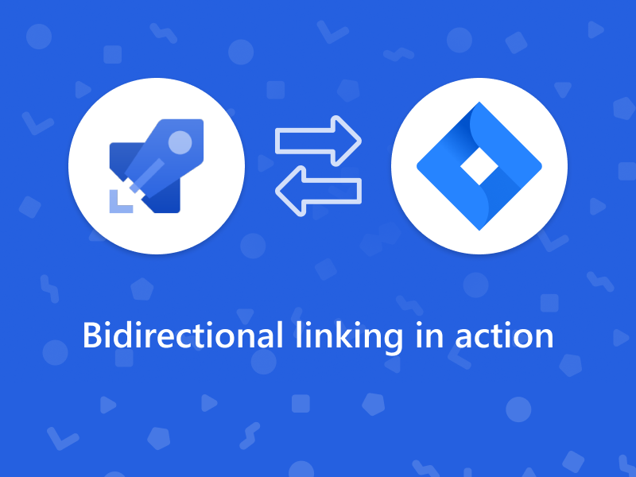
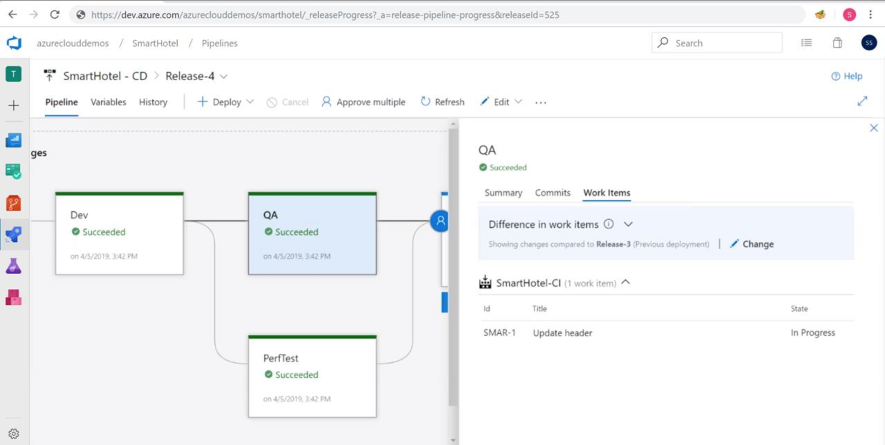
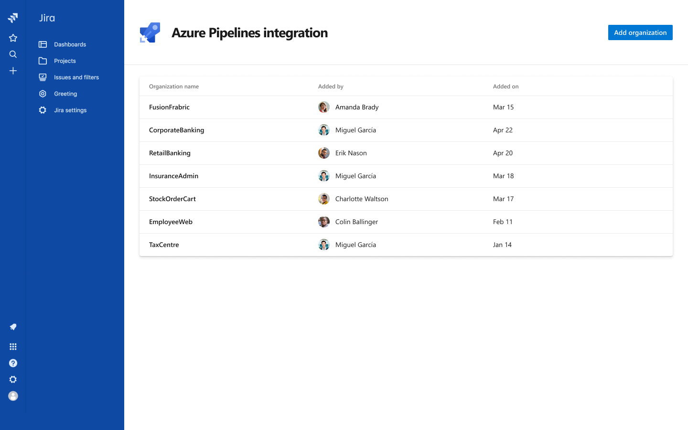

# Azure Pipelines for Jira

## Add release information from Azure Pipelines to Jira issues

Giving teams a choice of tools for configuring development pipelines
helps establish a successful DevOps ecosystem and enhances collaboration
between cross-functional teams. High performing teams operate at their
best when best of breed systems work together to give a powerful
development pipeline that enables users to retain context as they move
between systems for details.

Jira Software is an established and market leading issue tracking
system, for agile teams to plan, track, and discuss work amongst them.
Using Azure Pipelines, teams configure CI/CD pipelines for applications
of any language, deploying to any platform or any cloud.

[Azure DevOps](http://www.azure.com/devops) and
[Atlassian](https://www.atlassian.com/) have partnered
together for [Azure Pipelines](http://www.azure.com/pipelines)
integration with [Jira software](https://www.atlassian.com/software/jira). This app would be available for installation on the Atlassian marketplace soon. [Contact Us](mailto:rm_customer_queries@microsoft.com) for more details.

Azure Pipelines integration with Jira connects the two services,
providing full tracking of how and when the value envisioned with an
issue is delivered. Using the integration, teams can setup a tight
development cycle from issue creation through release. Key development
milestones for an issue can be tracked from Jira.

Associated Jira issues can also be viewed in builds and releases for a
complete deployment history per environment.

It is common for teams to use Jira for issue tracking, GitHub as a
source repository and Azure Pipelines for CI/CD. Developers use smart
commit syntax to link their commits to Jira issues, while Azure
Pipelines automatically keeps track of the commits consumed in each
build and release.

By adding build and release information from Azure Pipelines to
associated issues, we complete a three-way linking of information. Teams
can start from any of the three services to get planning, development
and deployment details for a capability. Jira users can understand
whether the feature can be used by end customers, developers can track
whether their commits have been deployed to production, and release
managers can create release notes in a jiffy.

Get started by installing [Azure Pipelines integration with
Jira](http://test.com) to connect your Azure DevOps organizations with your
Jira instance. You can connect multiple organizations with one Jira
instance and get data for all your teams and related projects.

[Contact us](https://developercommunity.visualstudio.com/content/problem/post.html?space=21) for more details.
